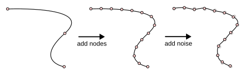

# xkcdify
This Inkscape extension adds randomness to paths in order to make them look hand-drawn in the style of [xkcd](https://xkcd.com/) comics.

## Example
This is a recreation of [xkcd #688](https://xkcd.com/688) in Inkscape before and after applying xkcdify. You can find the SVG file in the [docs](docs) folder.

## Installation
### Inkscape Extension Manager
I have submitted this extension to the Inkscape team for review, so hopefully it should be available on the Extension Manager soon

### Manual installation
Download the latest release from the [Releases page](https://github.com/guimeira/xkcdify).
Open Inkscape and go to **Edit > Preferences**. Open the **System** tab on the left panel. You'll see a list of folder names.
Locate the **User extensions** folder and click **Open**.
Extract the files from the xcdify release you just downloaded into this folder and restart Inkscape.
Optionally, download the Humor Sans font [here](https://github.com/shreyankg/xkcd-desktop/blob/master/Humor-Sans.ttf) and install it.

## Usage
Select the paths and texts you want to xkcdify, then go to **Extensions > Modify path > xkcdify**.
Use the **Squiggles** tab to tune the effect. You can enable the live preview using the checkbox at the bottom.

This extension can also change the font of all the texts you selected to Humor Sans, which looks similar to the texts on xkcd.
To enable/disable this, use the **Replace fonts** tab.

Use the **Other** tab to control the maximum segment length (more details below) and the RNG seed.

**Note:** this extension only processes paths. If you're trying to xkcdify rectangles, ellipses and other random shapes, convert them to paths first using **Path > Object to path**.

## How it works
First, we split the path into smaller segments. The maximum length of each segment is determined by a setting in the **Other** tab. This effect is similar to the one in the **Add nodes** extension that comes with Inkscape (in fact, a good part of the code was taken from that extension).

Then, we'll add some noise to each one of the nodes we just created. The logic for adding the noise was adapted from the one in [matplotlib](https://github.com/matplotlib/matplotlib/blob/96c9a3049477715f9dd21c6a945b3f2006ebad4e/src/path_converters.h#L995-L1104) (in case you didn't know, [matplotlib lets you plot graphs in the style of xkcd!](https://matplotlib.org/stable/api/_as_gen/matplotlib.pyplot.xkcd.html)).

Basically, we compute how much we'll displace each node by generating a random number and passing it through a sine function, which causes the resulting path to look squiggly. Each node is moved in a direction that is perpendicular to the current direction of the path.

